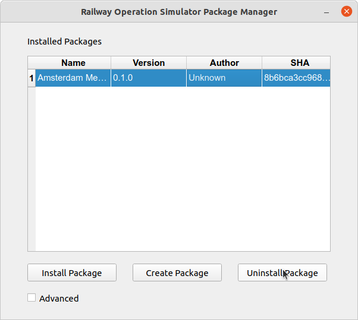

# Getting Started
## Initial Setup
Railway Operation Simulator Package Manager can be installed anywhere on your system. During the initial launch of the program you will be
asked to provide the path to your local `railway.exe` executable which exists inside the `Railway/` folder of
your *Railway Operation Manager* installation.

!!! important "Updating `railway.exe` Location"
    As the program is still in beta, no functionality yet exists for altering the location of Railway Operation Simulator at a later
    point. In order to do this you will need to manually remove the cache file for the application, found at:   
    
    **Windows**

        C:\Users\<USER>\AppData\Local\RailOSPkgManager\cache\ros_cfg
    
    **UNIX**

        /home/<USER>/.cache/RailOSPkgManager/ros_cfg

    This will reset the application, and it will ask you to provide the location again.

## Installing a Package
Packages are archive files downloaded from the Railway Operation Simulator application [website](https://www.railwayoperationsimulator.com/pc/community-projects). These must be downloaded manually, as they require login into the website.

Once a package has been downloaded, if it contains all the required file types it will be installed with the files
placed in the correct locations for you to be able to launch the contained simulation.

<figure markdown>

</figure>

<figure markdown>

</figure>

## Uninstalling a Package
To uninstall a package simply select it from the list of installed add-ons and click "Uninstall Package".

<figure markdown>

</figure>
<figure markdown>

</figure>