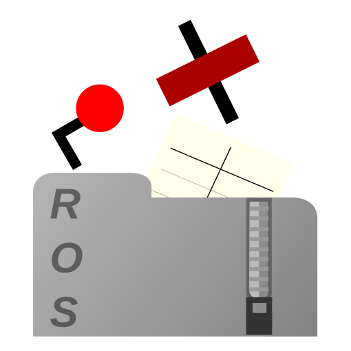

</img>

# Railway Operation Simulator Package Manager

*Quick and easy add-on management for Railway Operation Simulator*

Railway Operation Simulator Package Manager (RailOSPkgManager) is an interface providing a simple way of managing
simulations installed on your local copy of [Railway Operation Simulator](https://www.railwayoperationsimulator.com/).
Information defining the property of packages is taken from/stored in a metadata file.

The software allows you to:

- Install add-ons into your existing Railway Operation Simulator installation.
- Create packages using available files.
- Remove these additions from the relevant application folders.

It is important to note RailOSPkgManager follows the strict metadata file standard, and as such creation of a package
is only possible if ALL requirements are satisfied, i.e. simulation files, documentation and basic information
are provided.

**NOTE**: Graphics files which are of type BMP will not be copied to the Graphics folder but rather to the Images folder
this is because the wildcard `*.bmp` is associated with Image files.

## Developers
- [Kristian Zarebski](https://github.com/artemis-beta/)

## Contributors
- [jkwok678](https://github.com/jkwok678)

