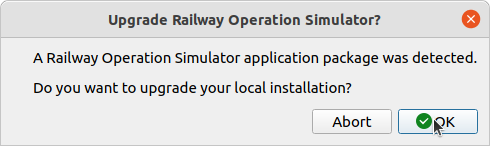

# Upgrading Railway Operation Simulator
In addition to the installation of add-ons, RailOSPkgManager can handle the switching of base program version,
performing a pseudo-upgrade.
If the user specifies a downloaded zip file containing an Railway Operation Simulator version (recognised by the presence of a `railway.exe` file), the program offers to replace the files in the local system installation with the new files. The term "pseudo" refers
to the fact that the program does not recognise one version as newer than another, as such this method can also be used
to perform a downgrade.
<figure markdown>

</figure>
<figure markdown>

</figure>
<figure markdown>

</figure>
<figure markdown>

</figure>

This greatly simplifies the process of patching your local version when a new release of Railway Operation Simulator is made. Releases for the program are available on the base program [download page](https://www.railwayoperationsimulator.com/catalog/base-program/railway-operation-simulator).